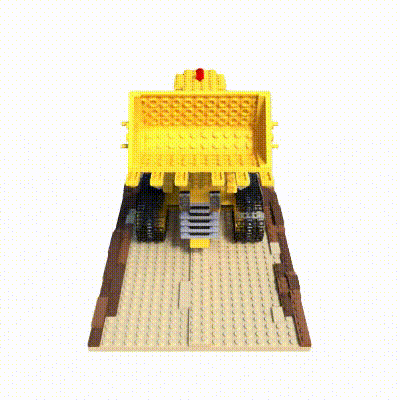

# NeRF Models
This is a implementation of [NeRF](http://www.matthewtancik.com/nerf) (Neural Radiance Fields), which is in the procedure of simdltk and supports Multi-GPU training.
It is based on the code of [NeRF-PyTorch](https://github.com/yenchenlin/nerf-pytorch), and adds implementation of Dataset/NeRFModel and several changes of monitoring. 


## Requirements 
```
pip install -r examples/nerf/requirements.txt
```

## Data 
```
mkdir -p local/data && cd local/data
wget http://cseweb.ucsd.edu/~viscomp/projects/LF/papers/ECCV20/nerf/nerf_example_data.zip
unzip nerf_example_data.zip
```


## Train 


## Results 
Generated Lego video: 



## Reference
- [NeRF-PyTorch](https://github.com/yenchenlin/nerf-pytorch)
- [NeRF Tensorflow](https://github.com/bmild/nerf)

